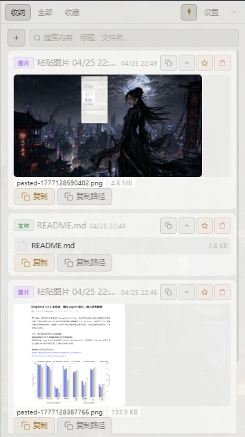
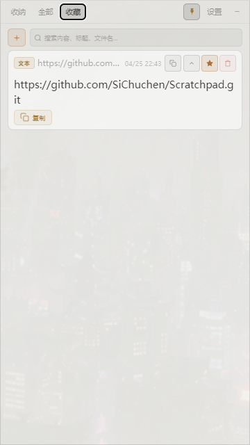
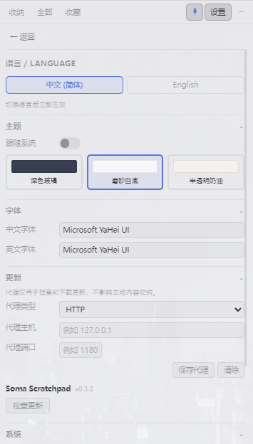
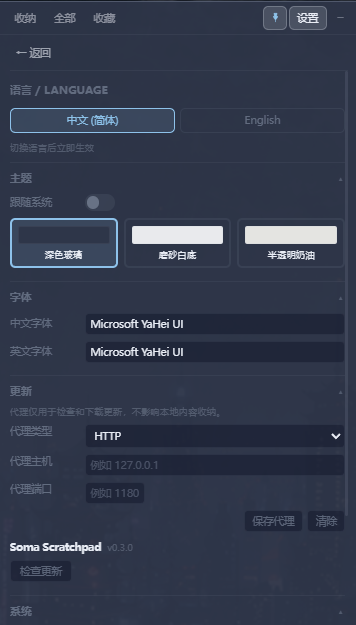
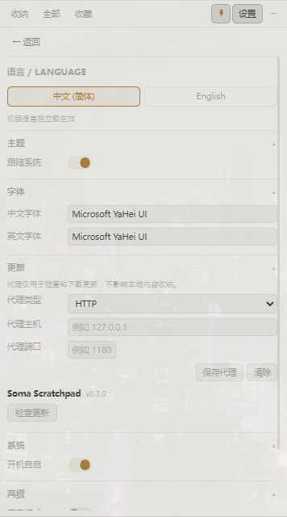

<div align="center">

# Soma Scratchpad

**A Windows desktop scratchpad designed for AI-assisted programming**


[](https://github.com/SiChuchen/Scratchpad/releases/latest)
[](https://github.com/SiChuchen/Scratchpad/releases/latest)
[](LICENSE)

[**Download Latest**](https://github.com/SiChuchen/Scratchpad/releases/latest) &nbsp;·&nbsp; [Features](#features) &nbsp;·&nbsp; [Quick Start](#quick-start) &nbsp;·&nbsp; [Development](#development)

Collect text, screenshots, and files with `Ctrl+V`. Copy content or paths in one click. Keep your desktop and Git repo clean.

[中文文档](README_ZH.md)

</div>

---

## Why

When working with AI coding assistants like Claude Code, Codex, Cursor, or ChatGPT, you may run into these problems:

- Error screenshots dumped into the project directory get committed to Git by AI agents
- Long prompt texts need editing, but chat boxes truncate them — you copy out, edit, paste back, repeat
- Temporary code snippets, logs, links, and file paths scatter across the desktop and clipboard
- You want to share an image or file with an AI without polluting your working directory

Soma Scratchpad is a **floating, always-on-top staging area** on your desktop. Drop things in, use them, let them go.

---

## Features

### Text

Paste text and it gets an auto-generated summary title. Rename it to whatever makes sense — even collapsed, you can tell what each entry contains at a glance. Expand to edit inline, then one-click copy. No window switching needed.

### Images

Take a screenshot and `Ctrl+V` to import it. Images are stored in the scratchpad's own directory. Two copy modes:

- **Copy image content** — paste directly into chat, docs, etc.
- **Copy image path** — paste the local path for AI tools to read

Images never land in your project directory and won't end up in Git commits.

### Files

`Ctrl+C` a file in Explorer, then `Ctrl+V` in the scratchpad to import. You can also drag and drop files directly. Both content copy and path copy are supported.

### Dock / Favorites / All

| View | Purpose |
|------|---------|
| **Dock** | Temporary staging area — unpinned entries are cleared on each launch |
| **Favorites** | Click the star button to keep entries permanently, even across restarts |
| **All** | Browse all entries by time, with filters for text / images / files |

### Desktop Presence

- **Pin mode** — toggle always-on-top with one click; unpin when you don't need it
- **Minimize** — collapses to a small cat icon on the screen edge; one click to restore
- **Global hotkey** — `Alt+Shift+V` to toggle window visibility
- **System tray** — runs quietly in the background

### Settings

- **Three themes** — Dark Glass / Light Matte / Light Frosted, plus auto-detect system preference
- **Fonts** — configure Chinese and English fonts separately
- **Bilingual UI** — switch between Chinese and English instantly
- **Proxy update** — configure HTTP / SOCKS5 proxy for version checks and downloads
- **Auto-start** — optionally launch on system startup
- **Auto-cleanup** — configure how many days to keep unstarred entries (default: clean on every launch)

---

## Screenshots

<p align="center">
  
  &nbsp;&nbsp;
  
</p>

<p align="center">
  <em>Text editing &nbsp;&nbsp;|&nbsp;&nbsp; Images &amp; files</em>
</p>

<p align="center">
  
  &nbsp;&nbsp;
  
</p>

<p align="center">
  <em>All entries with filters &nbsp;&nbsp;|&nbsp;&nbsp; Settings</em>
</p>

<p align="center">
  
  &nbsp;&nbsp;
  
</p>

<p align="center">
  <em>Minimized state &nbsp;&nbsp;|&nbsp;&nbsp; Desktop cat</em>
</p>

---

## Download & Install

Grab the latest release from [GitHub Releases](https://github.com/SiChuchen/Scratchpad/releases/latest):

| File | Description |
|------|-------------|
| `Soma Scratchpad_x.x.x_Windows.exe` | NSIS installer — recommended for most users |
| `Soma Scratchpad_x.x.x_Windows.msi` | MSI installer |
| `Soma Scratchpad_x.x.x_Windows_Portable.zip` | Portable version — unzip and run |

The app checks for updates automatically. If you're behind a proxy, configure it in Settings.

---

## Quick Start

1. **Paste** — copy text, a screenshot, or a file, then `Ctrl+V` in the scratchpad
2. **Edit** — expand a text entry to edit inline
3. **Rename** — click the title to rename, so you can identify entries when collapsed
4. **Copy** — click the copy button; text copies content, images and files support content or path copy
5. **Favorite** — click the star button to keep entries permanently in Favorites
6. **Minimize** — collapse to the desktop cat icon; click to restore

---

## Data Safety

- All data is stored in a `data/` directory next to the application executable — nothing in system directories
- SQLite local database — nothing is uploaded to the cloud
- Images and file attachments are organized under `data/assets/YYYY-MM-DD/`
- To reset, simply delete the `data/` directory

---

## Tech Stack

| Layer | Tech |
|-------|------|
| Framework | [Tauri 2](https://v2.tauri.app/) |
| Backend | Rust |
| Frontend | [Svelte 5](https://svelte.dev/) + TypeScript + Vite |
| Storage | SQLite (rusqlite) |
| Platform | Windows 10+ |

---

## Development

```bash
# Install frontend dependencies
pnpm install

# Start dev mode (frontend + Rust backend with hot reload)
pnpm tauri dev
```

Frontend type check:

```bash
pnpm check
```

Rust tests:

```bash
cd src-tauri && cargo test
```

---

## Build

```bash
pnpm tauri build
```

Output goes to `src-tauri/target/release/bundle/`. See `package.json` scripts for all available commands.

---

## Roadmap

- [ ] Richer entry types (link previews, code syntax highlighting)
- [ ] Keyboard-driven workflow improvements
- [ ] Cross-platform exploration (macOS / Linux)

---

## License

[MIT](LICENSE)
